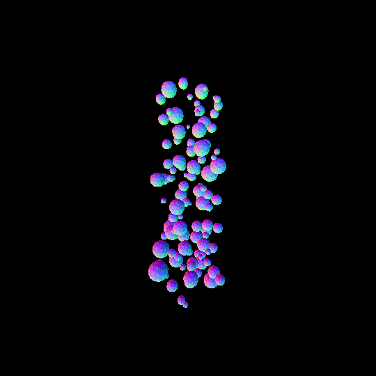
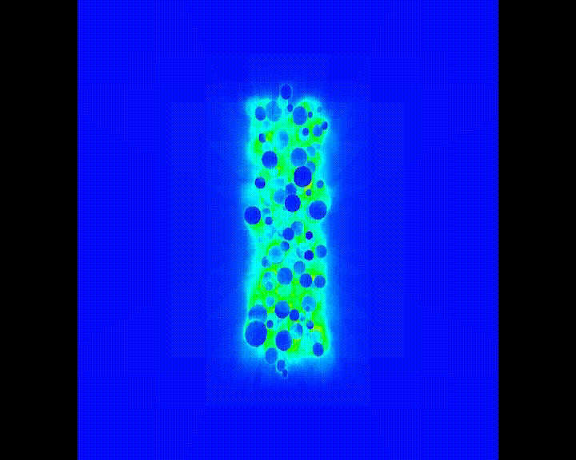

# 4D Sparse voxel octree renderer

This is the rendering program implemented for Computer Science master's thesis: [ Abstraction of Sparse Voxel Octrees to Four Dimensions for Storing and Rendering Animated Models ](https://limo.libis.be/primo-explore/fulldisplay?docid=32LIBIS_ALMA_DS71188553570001471&context=L&vid=KULeuven&search_scope=ALL_CONTENT&tab=all_content_tab&lang=en_US).
It renders animated models stored in fourdimensional hyperoctrees, generated using [another program from my master's thesis, of whcih the source code can be found in another repository.](https://github.com/joschout/OOC-4D-SVO-Builder/)  The program generating an octree is an adaption of OOC-SVO from ForceFlow.

